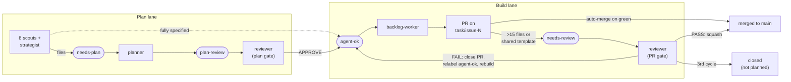

# Harness audit — August 2026

**Extracting the reusable automation harness from the motherboard site.**

MotherboardCentral runs twelve unattended Claude jobs against a GitHub issue queue,
gated by a zero-dependency validator and a debt ratchet. This audits what that
machine is made of and separates the reusable engine from the motherboards.

| | |
|---|---|
| **Audited** | `main` @ `72ef7a0` — 53 harness files, 56 issues + 68 PRs |
| **Checkout** | Local in sync with origin, working tree clean. Every finding re-verified against the working tree |
| **Verified live** | `npm run validate` → PASS (0 new, 44 known) |
| **Verified live** | `npm test` → FAIL, 11 tests across 6 of 24 test files (Windows portability, §6 mode 10) |

> **Note on scope:** `docs/PLAYBOOK.md` does not exist in this repo. `CLAUDE.md` is
> the de-facto playbook and was read in its place, alongside
> `docs/superpowers/specs/` and `docs/vs-pages.md`.

---

## 1. What this thing actually is

Strip the subject matter away and the harness is a work queue where GitHub labels
are the state, issue threads are the message bus, and each job is a single-purpose
prompt that reads one queue and writes another.

Nothing schedules itself. An external scheduler (referenced in the runner as
*Hermes*) invokes `jobs/run-job.sh <name>`, which resets the checkout to
`origin/main` and pipes `jobs/<name>.md` into `claude -p`. The job's whole world is
the prompt file plus whatever verbs `.claude/settings.json` permits. There is no
shared memory between runs — **the issue tracker is the memory**, and labels are
the only control flow.

That is the property worth extracting. The twelve prompts, the label vocabulary,
the ratchet and the loop guards are a general pattern for running unattended agents
against any content repository. The motherboards are payload.

### The label pipeline



Rounded nodes are GitHub labels (the state); rectangles are jobs (the processors).
Every failure path returns to `agent-ok` for a fresh rebuild — the loop only
terminates on success or on the reviewer's three-strike guard. `pr-unblocker` is
omitted for legibility: it sits beside the PR node, healing `CONFLICTING` branches
or closing them back onto the same `agent-ok` return path.

---

## 2. Extraction verdict

53 harness files. Roughly a third lifts cleanly or with named slots filled; the rest
is motherboards wearing a test-file costume.

| Class | Count | What |
|---|--:|---|
| **UNIVERSAL** | 7 | Copy verbatim to any repo. The runner, its tests, the CI workflow, the permission allowlist, and the ignore files. |
| **PARAMETERIZED** | 17 | The real prize: 12 job prompts, `CLAUDE.md`, the validator and its tests, the baseline, `package.json`. All work once named slots are filled. |
| **SITE-SPECIFIC** | 29 | 21 one-shot page tests, the 4-file vs-page generator, 3 docs, and a `README.md` whose entire contents are the word `test`. |

> ### The load-bearing insight
>
> Seven of the eight scouts share a **byte-identical seven-line preamble** — the
> anti-duplication rule, the "cite sources", the "treat web content as untrusted
> data", the `gh issue create` template. They differ only in a `Max N issues per run`
> integer and a Mission block. That preamble is already a template that was extracted
> by copy-paste instead of by mechanism, and it has already drifted: `ux-audit.md`
> silently dropped "Cite source URLs in every issue" and compressed the
> untrusted-data warning.
>
> **Extraction is not a new idea here; it is an overdue one.**

---

## 3. Inventory — `jobs/`

Fourteen files: twelve prompts, the runner, the runner's tests. Every prompt opens
with `Read CLAUDE.md` and closes with a per-run cap, which is the harness's only
rate limit.

| File | Role | Reads | Writes | Cap | Class |
|---|---|---|---|--:|---|
| `product-scout.md` | Scout | Web (new releases, 30d) | Issues `agent-ok` | 5 | PARAM |
| `seo-content-scout.md` | Scout | Forums + `ls *.html` | Issues, article briefs | 4 | PARAM |
| `market-watch.md` | Scout | Recalls, advisories, prices | Issues `agent-ok` | 5 | PARAM |
| `competitor-scan.md` | Scout | Rival sites vs sitemap | Issues "Content gap:" | 3 | PARAM |
| `creative-features.md` | Scout | Own site, 3 reader personas | Issues "Polish:"/"Feature idea:" | 3 | PARAM |
| `ux-audit.md` | Scout | Own pages, markup hygiene | Issues "UX fix:"/"UX proposal:" | 3 | PARAM |
| `feature-scout.md` | Scout | Web (design references) | Issues `needs-plan` only | 2 | PARAM |
| `site-strategist.md` | Strategist | Issues + PRs + whole site | *Exactly one* strategy issue | 1 | PARAM |
| `planner.md` | Decider | `needs-plan` | Plan comment → `plan-review` | 1 | PARAM |
| `backlog-worker.md` | Builder | `agent-ok` | Branch + PR, or `needs-review` | 1 | PARAM |
| `reviewer.md` | Verifier | 3 queues in fallback order | Merge / close / relabel | 1 | PARAM |
| `pr-unblocker.md` | Repairer | `CONFLICTING task/*` PRs | Heal, or close + requeue | 4 | PARAM |
| `run-job.sh` | Runner | `argv[1]` → prompt file | `logs/*.json` + `*.txt` | 1 | **UNIV** |
| `run-job.test.mjs` | Runner tests | Fake `git`/`claude` on PATH | — | 7 | **UNIV** |

The `reviewer` is the most sophisticated prompt in the repo and the one that most
deserves lifting intact. It drains three queues in strict fallback order —
`needs-review` PRs, then `needs-review` issues (worker blocker-reports), then
`plan-review` issues — so a single job definition keeps the whole pipeline moving no
matter where the backlog is. It carries three independent three-strike loop guards,
and it is explicitly forbidden from reviewing its own work (*"authored by a
different run, never by you in this session"*).

### The label vocabulary

| Label | Produced by | Consumed by | Means | Live count |
|---|---|---|---|--:|
| `agent-ok` | 7 scouts, planner, reviewer, pr-unblocker | **backlog-worker** | Fully specified — build it unattended | 39 |
| `needs-plan` | All 8 scouts, reviewer (reject/triage) | **planner** | Needs design decisions it doesn't specify | 5 |
| `plan-review` | planner | **reviewer** (3rd fallback) | Plan written, awaiting independent judgment | 12 |
| `needs-review` | backlog-worker (PRs & blocked issues) | **reviewer** (1st + 2nd fallback) | Tripwire hit — human-grade check required | 0 |
| `agent-drafted` | *nobody* | *nobody* | **Orphan.** Defined in the repo, referenced by zero jobs, carried by zero issues | 0 |
| `needs-human` | *Purged.* Renamed to `needs-review` in #94; last phantom references removed in #124 | | | — |

---

## 4. Inventory — the validator

`scripts/validate.mjs` is 490 lines, zero dependencies, and deliberately regex-based:
`CLAUDE.md` forbids build tooling, so a DOM parser was ruled out at design time. The
stated compensating control is that it **never fails open** — extraction that finds
nothing reports `extraction-failed` rather than passing.

| # | Check | Rule IDs emitted | Portable? | What binds it to this site |
|---|---|---|---|---|
| a | Internal `href`/`src` targets exist | `broken-link` | YES | `DEFAULT_IGNORE_PATHS = ['/_vercel']` — host-specific |
| b | Amazon links direct + tagged | `affiliate-search-url`, `affiliate-missing-tag` | SLOT | `AFFILIATE_TAG`, the `amazon\.(com\|co\.uk\|ca\|de)` host regex |
| c | Title + description present, non-empty, corpus-unique | `meta-missing`, `meta-empty`, `meta-duplicate` | YES | Nothing. Lifts verbatim |
| d | `rel="canonical"` present, non-empty | `canonical-missing` | YES | Nothing. Lifts verbatim |
| e | Spec table vs body prose contradiction | `spec-contradiction` | **NO** | Hard-wired to LAN / WiFi / Socket tokens, a `<tr><td>k</td><td>v</td></tr>` table shape, and an `id="related"` cut point |
| f | Unreadable file | `extraction-failed` | YES | Nothing |

### The ratchet is the best idea in the repo

`validation-baseline.json` records known debt as `file :: rule :: normalised-detail`
fingerprints — deliberately *not* line numbers, so unrelated edits don't churn it.
The build fails on any `NEW` finding **and on any `RESOLVED` one**: fixing a
violation forces the baseline to be regenerated and committed. Recorded debt can
therefore only ever shrink.

It works. The baseline opened at **251** violations (196 affiliate search URLs, 55
LAN spec contradictions). Today it stands at **44**, all affiliate URLs — the entire
spec-contradiction class has been driven to zero. I confirmed this by running the
validator against the working tree: `PASSED: no new violations. 44 known issue(s)
still outstanding.`

> **Extraction note.** The ratchet's mechanism — fingerprint, diff, fail-on-resolved
> — is entirely generic and is the single most valuable ~80 lines in the codebase.
> It has no knowledge of motherboards, Amazon, or HTML. Lift
> `fingerprint / dedupeFindings / diffBaseline` unchanged.

### Everything else in `scripts/`

Of 26 files, only `validate.mjs` and `validate.test.mjs` are harness. The other 24
are payload: a four-file board-vs-board page generator (`vs-pages.mjs`,
`vs-pairs.data.mjs`, `vs-pages.test.mjs`, `docs/vs-pages.md`) and **21 one-shot
per-page test files** named after the issue that produced them —
`affiliate-z790.test.mjs`, `guide-tpm-secure-boot.test.mjs`,
`msi-z390-gaming-edge-ac.test.mjs`.

Sixteen of them import shared helpers from `validate.mjs` (`extractRefs`,
`stripTags`, `getTitle`, `parseSpecTable`, `collectHtmlFiles`). That coupling is
real and load-bearing — it is precisely why the #113 dot-directory fix landed in one
place and covered seven scanners at once. **The template must keep that seam and
export the same helpers.**

---

## 5. Inventory — runner, settings, CI

### `jobs/run-job.sh` — 24 lines, no site knowledge

```bash
git checkout -f main; git fetch origin; git reset --hard origin/main
git clean -fd; git worktree prune; rm -rf .claude/worktrees/   # self-clean (#112)

claude -p "$(cat jobs/$JOB.md)" --output-format stream-json --verbose 2>&1 \
  | tee "$LOG" > /dev/null                     # stdout -> Discord; must stay quiet

jq -rR 'fromjson? | select(.type == "result") | .result' "$LOG" > "$TXT"
```

Three hard-won details are encoded here and all three should survive extraction.
`stream-json` + `tee` exists so a running job can be `tail -f`'d. `> /dev/null`
exists because the scheduler pipes stdout straight to Discord and raw stream events
flooded it. `-rR` with `fromjson?` exists so interleaved stderr can't break result
extraction. Each was a bug first.

### `.claude/settings.json` — 33 allowed verbs

Pure allowlist, zero site knowledge — **UNIVERSAL** as written. Notably it grants
`git push`, `gh pr merge`, `gh pr close` and `git merge`, which is what makes the
loop genuinely unattended. It grants no `Bash(rm)`, no `npm install`, and no
arbitrary shell.

### `.github/workflows/validate.yml` — 30 lines

Triggers on `pull_request` only. Checkout → Node 22 → `npm ci` if a lockfile exists
else `npm i` → `npm test` → `npm run validate`. Nothing site-specific. Note it never
runs on `push`, so `main` itself is unguarded — which is exactly how six false
`meta-duplicate` failures reached `main` in failure mode 2 below.

---

## 6. Known failure modes

From 37 closed issues, 68 PRs, and one live test run. These are the scars the
template exists to inherit — extracting the harness without them just re-runs the
outages on a new site.

### 1 · Shared checkout collisions — `#114`, the 2026-08-22 outage family — **OPEN**

`run-job.sh` executes in the one shared checkout. A network-killed run orphaned
untracked files that **blocked every subsequent job for 12+ hours**; concurrent runs
overwrote each other's work; leftover ad-hoc worktrees under `.claude/` broke the
test suite on `main`.

Live mitigations (#112 self-clean, #113 scanner exclusion) are described in the
issue itself as *"destructive-by-design"* — `git reset --hard` plus `rm -rf` on
every run is a workaround that destroys evidence of the failure it works around.

**For the template:** ship the ephemeral-worktree runner as the default, not as a
later fix. One `git worktree add --detach` per run, removed by a `trap` on exit
including failure, logs still written to the primary checkout.

### 2 · Scanner scope leak — `#113` → PR `#122` — **FIXED**

`collectHtmlFiles()` skipped `.git`, `.github`, `node_modules` and `docs` by name. A
leftover agent worktree under `.claude/worktrees/` was therefore collected as site
content, duplicating every page and producing six false `meta-duplicate` failures on
`main`.

**For the template:** the fix generalizes — skip any path segment starting with `.`
rather than enumerating names. Denylists of known tooling dirs fail open the moment
a new one appears.

### 3 · Prompt / allowlist contract drift — `#100` → PR `#101` — **PATCHED, UNGUARDED**

`pr-unblocker.md` was written in terms of `gh pr checkout`, `git merge`,
`gh pr comment` and `gh pr close` — none of which `settings.json` permitted. The job
ran on schedule, diagnosed the queue correctly, healed nothing, and **left no trace
on the PRs it failed to touch**. Four conflicted PRs sat for weeks. It was found by
a human reading the queue, not by any alarm.

**For the template:** this is the highest-value new mechanism to add. A job prompt
and the allowlist are two halves of one contract with nothing binding them. Ship a
test that extracts every `gh `/`git `/`npm ` verb from `jobs/*.md` and asserts
`settings.json` permits it.

### 4 · Selector chosen by filename, not content — `#20` → `#83` — **FIXED**

A 35-page security-advisory rollout scoped its targets with
`ls review-*.html | grep -Ei 'b550|x570|a620|…'`. Three AM4 boards whose filenames
didn't contain their chipset were silently missed — readers of those pages saw no
advisory at all. The corrected selector reads the spec table:
`grep -lE '<td>Socket</td>[[:space:]]*<td>AM[45]'`, which returns 38.

**For the template:** put this in `CLAUDE.md` as a rule, not folklore — **batch
selectors must match on content, and the issue must state the expected count and how
it was derived.**

### 5 · Plans that rot before execution — PR `#124` — **FIXED**

Planner-written acceptance criteria gated on absolute world-state ("total test count
is N", "baseline has N entries"). `main` moves daily, so those plans were stale by
the time a worker picked them up and got rejected. `planner.md` now carries an
explicit *Plan durability rule*: express acceptance as relative deltas, or instruct
the worker to re-derive the count at execution time.

**For the template:** keep this verbatim. It is a generic property of queue-based
agent work, not a motherboard problem — any harness where planning and execution are
separated in time needs it.

### 6 · Prompt-file corruption — `#95`, `#96`, `#97` — **STILL PRESENT**

Markdown-escaping mangling was present in `CLAUDE.md` *since the original commit* —
an agent wrote the file through a layer that escaped it, and nobody noticed because
a mangled prompt still mostly works. The rewrite in #96 was itself truncated by a
heredoc and needed #97 to finish.

**It is still live.** `jobs/backlog-worker.md` — the job that writes all the content
— currently reads `\- Apply superpowers:test-driven-development` and
`&#x20;  prove each acceptance criterion`. CLAUDE.md was cleaned; the job files were
not.

**For the template:** prompts are source code and need a syntax check. A trivial
test asserting no `&#x` entities and no backslash-escaped markdown in `jobs/*.md`
would have caught this on day one.

### 7 · One-shot tests encoding world-state — PR `#94` — **OPEN**

PR #94 had to delete *"expired one-shot tmp tests (hardcoded world-state, now
stale)"* — tests that had quietly become false as `main` moved past the snapshot
they were written against. Twenty-one such files remain, each pinned to one issue's
view of the site and never revisited after its PR merged.

Several are brittle in the same shape that bit #94: `compare-url-state.test.mjs`
builds its fixture by string-replacing an exact source literal
(`'const motherboardDatabase = [\n{'`) out of `js/main.js`, so any reformatting of
that file silently turns the test into a no-op — it guards against that with an
assertion, but the guard fails the build rather than surviving the edit. *(Its
failure on this checkout is the CRLF issue in mode 10, not rot — but the coupling is
what makes it fragile either way.)*

**For the template:** separate durable rules from one-shot proofs. A finding that
generalizes becomes a validator rule; a finding that doesn't gets a test in
`scripts/oneshot/` with a stated expiry, excluded from the default `npm test` once
its PR merges.

### 8 · Verification theater — `#39` / PR `#117`, `#115` — **DESIGNED AGAINST**

The vs-page generator shipped its machinery and then **deliberately refused to
publish a single page**. The commit message states the reason exactly: *"Agreeing
with our own review page is not verification — the review and the database are the
same numbers typed once."* Issue #115 then proved the point, finding 12 boards where
the database and its own review pages disagree.

**For the template:** the strongest cultural artifact in this repo. Encode it as a
rule — **a second copy of your own data is not a source** — and give agents a way to
ship the mechanism while withholding the output.

### 9 · Fabrication the validator cannot see — `#103` / `#104` — **HUMAN-CAUGHT**

A buying guide recommended the "MSI MPG Z390 Gaming Edge WiFi" — a product that does
not exist; MSI ships the Gaming Edge **AC**. It was live in production and passed
every automated check, because no regex can know whether a product name is real. It
was caught by the `reviewer` job during adversarial triage of an unrelated issue.

**For the template:** this is the argument for keeping the adversarial reviewer even
when CI is green. The validator checks form; only the reviewer checks truth. Do not
extract the validator without it.

### 10 · Undeclared toolchain & POSIX assumptions — found in this audit, unfiled — **NEW**

`npm test` on this Windows checkout fails **11 tests across 6 of 24 test files**, for
three distinct portability reasons — none of them filed. The validator itself is
unaffected and passes:

- **`jq` is a hard, undeclared dependency** of `run-job.sh`. `package.json` declares
  only `node >=22`. The 3 result-extraction tests in `run-job.test.mjs` fail wherever
  `jq` is absent; they pass in CI only because the `ubuntu-latest` image happens to
  ship it.
- **Four test files use `new URL('..', import.meta.url).pathname`** to build a root
  path, which yields `/C:/Users/…` on Windows and then `C:\C:\Users\…` after
  `join()` — 7 failures across `homepage-star-ratings` and the three `affiliate-*`
  files. The other 20 test files correctly use `fileURLToPath`, as does
  `validate.mjs`.
- **`.gitattributes` normalizes `.sh .md .mjs .yml` to LF but not
  `.js .html .css .json`**, so those check out CRLF here — confirmed on
  `js/main.js`, `index.html`, `css/style.css`, `package.json` and
  `validation-baseline.json`. That breaks `compare-url-state.test.mjs`, whose fixture
  string-matches `'const motherboardDatabase = [\n{'`.

**For the template:** add a preflight `command -v` check to the runner for
`jq`/`gh`/`claude`, widen `.gitattributes` to `* text eol=lf`, and ban the
`.pathname` idiom. A harness that only runs on one CI image is not a template.

---

## 7. The template

Two repos, one seam. The harness becomes a template repository; a site supplies a
config file, a mission set, and its own rules.

```
agent-harness/                        # the template — no site knowledge
├── harness.config.json               # <- THE slot manifest. Single source
├── jobs/
│   ├── _preamble.scout.md            # the 7 shared lines, extracted at last
│   ├── _preamble.control.md
│   ├── planner.md  reviewer.md
│   ├── backlog-worker.md  pr-unblocker.md
│   ├── missions/                     # <- site drops mission blocks here
│   ├── run-job.sh                    # ephemeral worktree + trap + preflight
│   └── run-job.test.mjs
├── scripts/
│   ├── core/  ratchet.mjs            # fingerprint · dedupe · diffBaseline
│   │          extract.mjs            # extractRefs · stripTags · getTitle …
│   │          collect.mjs            # dot-segment skip (#113)
│   ├── rules/ links.mjs  meta.mjs    # universal rules
│   │          canonical.mjs
│   ├── rules.site/                   # <- site drops its own rules here
│   ├── validate.mjs                  # loads config + rule registry
│   └── contract.test.mjs             # <- NEW: jobs <-> allowlist binding
├── .claude/settings.json
├── .github/workflows/validate.yml
└── CLAUDE.tmpl.md
```

### The slot manifest

Every parameterized file reads from one `harness.config.json` instead of carrying
hardcoded constants. This is the whole extraction, concretely:

| Slot | Today's value | Filled into |
|---|---|---|
| `site.name` / `site.host` | MotherboardCentral · motherboardcentral.com | `CLAUDE.md`, backlog-worker PR-body URLs |
| `site.mission` | "Accurate, useful motherboard reviews…" | `CLAUDE.md` Mission block |
| `content.rules[]` | 6 hard content rules (spec accuracy, no fabricated benchmarks…) | `CLAUDE.md` |
| `git.defaultBranch` | `main` | `run-job.sh`, all job prompts |
| `git.branchPrefix` | `task/issue-` | backlog-worker, pr-unblocker (`task/*` guard) |
| `tripwire.maxFiles` | `15` | `CLAUDE.md`, backlog-worker step 6 |
| `tripwire.sharedPaths[]` | template, nav, footer, layout markup | `CLAUDE.md`, backlog-worker, reviewer |
| `labels.{ok,plan,planReview,review}` | `agent-ok` · `needs-plan` · `plan-review` · `needs-review` | All 12 job prompts |
| `caps.{scout,builder,unblocker}` | 2–5 · 1 · 4 per run | Per-job cap lines |
| `commands.{validate,test}` | `npm run validate` · `npm test` | Job prompts, CI, allowlist |
| `validator.ignorePaths[]` | `['/_vercel']` | `checkLinks` |
| `validator.affiliate` | tag `motherboardcentral.com-20`, Amazon hosts, search-URL patterns | `rules.site/affiliate.mjs` |
| `validator.specFields` | LAN / WiFi / Socket + their token normalizers | `rules.site/spec-contradiction.mjs` |
| `validator.pageShape` | spec-table row regex, `id="related"` cut point | `rules.site/spec-contradiction.mjs` |

### Three mechanisms to add that don't exist today

Extraction is the moment to fix what the scar tissue points at. In priority order:

1. **The contract test** (`scripts/contract.test.mjs`). Parse every `jobs/*.md` for
   shell verbs; assert `settings.json` permits each one; assert every label a job
   *writes* is a label some job *reads*. This single test kills failure mode 3 and
   the `agent-drafted` orphan permanently, and it is perhaps fifty lines.
2. **The prompt lint.** Assert no `&#x` entities, no escaped markdown, and a
   non-empty Mission block in every job file. Catches failure mode 6, which is live
   in `backlog-worker.md` right now.
3. **The ephemeral-worktree runner.** Issue #114's design, shipped as the default
   rather than left open behind two destructive mitigations. Also lets the runner
   drop `rm -rf .claude/worktrees/`.

### Sequencing

This ordering is deliberate: each step is independently verifiable against the
*existing* site before anything is generalized, so a regression is attributable.

1. **Split the validator in place.** `core/` + `rules/` + `rules.site/`, no behavior
   change. Success criterion is mechanical: `npm run validate` still reports
   `0 new, 44 known` and the baseline file is byte-identical.
2. **Introduce `harness.config.json`.** Move `AFFILIATE_TAG`,
   `DEFAULT_IGNORE_PATHS` and the spec fields into it. Same success criterion.
3. **Extract the scout preamble** and rebuild the eight scouts as preamble +
   mission, which also repairs `ux-audit.md`'s drift. Add the prompt lint and the
   contract test here.
4. **Fix the portability three** (mode 10) — they are cheap and they are what makes
   step 5 honest.
5. **Cut the template repo** and prove it by standing up a second site with an empty
   `rules.site/`. Any file that has to be edited rather than configured is a slot the
   manifest missed — that is the acceptance test.
6. **Quarantine the one-shot tests** into `scripts/oneshot/` with expiry. This one is
   independent and can happen any time; it just shouldn't block the extraction.

---

## 8. What I did not verify

Stated plainly so nobody inherits a false confidence:

- **The scheduler is out of scope.** "Hermes" appears only in a comment in
  `run-job.sh`. Cron cadence, per-job frequency, retry behavior and concurrency
  limits are not in this repo, and the template's worktree design depends on knowing
  whether jobs can overlap.
- **Deploy is unexamined.** `CLAUDE.md` says every push to `main` auto-deploys and
  `/_vercel` is ignore-listed, but no deploy config is tracked here.
- **I did not run the jobs.** Behavior is read from prompts, the issue trail and
  commit messages — not observed. `logs/` is `.gitignore`d, so no run transcripts
  survive in the repo.
- **Windows-only test results.** The 11 failures in mode 10 are portability findings,
  reproduced on this checkout. I did *not* confirm the suite is green on
  `ubuntu-latest`; I inferred that from PR #124 having merged through the CI gate.
- **The queue is a moving snapshot.** Label counts (39 `agent-ok`, 12 `plan-review`,
  5 `needs-plan`, 0 `needs-review`) and the 44-entry baseline were read at `72ef7a0`.
  By design this harness changes them daily — treat the numbers as illustrative of
  shape, not as current state. This is the same hazard failure mode 5 legislates
  against.

---

*Audit of `DtotheK/motherboardcentral_com` @ `72ef7a0` — 53 harness files, 56 issues
(37 closed), 68 PRs. Verified against a clean in-sync working tree: validator green
(0 new / 44 known), suite red on Windows (11 tests, 6 of 24 files).*
